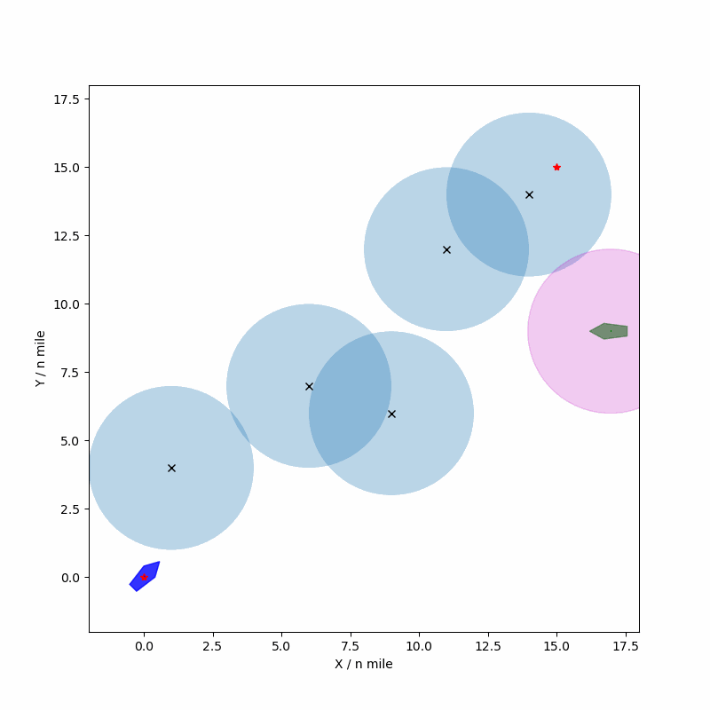

# 改进人工势场法 APF (Artificial Potential Field)


该模块实现了用于船舶避碰的改进人工势场法（APF）。在传统人工势场的基础上：
- 引入了对动态障碍物（他船）的处理与可视化；
- 融合 COLREGs（《1972年国际海上避碰规则》）规则力，使避碰更符合航行规则；
- 提供鲁棒的停滞/局部最小值检测与“逃逸模式”，缓解目标不可达与局部极小问题；
- 限速控制，使合力对应的期望速度不超过设定的船舶最大速度。

### 演示 (Demo)

建议运行脚本后，将生成的图像或动图放入本目录，并在此处展示：



> 上图可展示如“右交叉/对遇/追越”等会遇情形下的避碰效果。

### 主要特性 (Features)

- **改进APF核心**: 吸引力+斥力+规则力（COLREGs）融合，面向船舶避碰。
- **动态障碍支持**: `DynamicObstacle` 按速度与航向随时间更新位置，并记录轨迹。
- **COLREGs 规则力**: 
  - 规则13（追越）、规则14（对遇）、规则15（交叉）判别。
  - 在让路情形中默认施加“向右转”的规则力，增强规则一致性。
- **局部极小缓解**: 
  - 历史位置窗口检测停滞（振荡/不前进）。
  - 进入“逃逸模式”后，沿与斥力垂直且更有利于接近目标的一致方向施加强虚拟力，直至脱困。
- **限速控制**: 将合力视作期望速度并限幅到 `robot_max_speed`。
- **可视化**: 使用 `Matplotlib` 实时绘制本船、动态障碍物形状、斥力半径、轨迹等。

### 文件结构 (Files)

- `APF.py`: 改进 APF 的主实现（包含 `APF_Improved`, `DynamicObstacle` 等）。
- `Original_APF.py`: 提供 `APF`, `Vector2d` 等基础类（从中继承和复用）。

### 如何使用 (Usage)

直接运行脚本启动仿真：

```bash
python APF.py
```

运行后将打开绘图窗口，展示：
- 起点与终点；
- 静态障碍物（含斥力半径圆）；
- 动态障碍物的船体多边形、斥力半径圆与轨迹；
- 本船的多边形形状与实时轨迹。

### 关键类与函数 (Key Components)

- **`DynamicObstacle(start_pos, velocity, direction)`**: 定义动态障碍物（他船）。
  - `start_pos`: 初始坐标 `(x, y)`；
  - `velocity`: 标量速度；
  - `direction`: 航向（角度制，内部转为弧度）。
- **`APF_Improved(APF)`**: 改进 APF 主类。
  - 重要参数：
    - `k_att`, `k_rep`: 吸引/斥力系数；
    - `rr`: 斥力影响半径；
    - `step_size`, `max_iters`, `goal_threshold`；
    - `robot_max_speed`: 速度上限；
    - `is_plot`: 是否绘图；
    - `dynamic_obstacles`: 动态障碍物列表。
  - 重要方法：
    - `path_plan()`: 主循环，更新障碍、计算力、限速、更新位置、绘图。
    - `assess_situation()`: 基于相对方位与航向差判别会遇情形（追越/对遇/交叉）。
    - `calculate_rule_force()`: 按会遇情形施加“向右转”规则力。
    - `repulsion_dynamic()`: 结合静/动障碍的改进斥力模型。
    - `_calculate_escape_direction()`: 逃逸方向计算（与斥力垂直，选更指向目标的一侧）。

### 配置与自定义 (Configuration)

在 `__main__` 中可直接修改参数：

```python
k_att, k_rep = 2.0, 0.8
rr = 3                       # 斥力范围
step_size, max_iters = .2, 2000
goal_threashold = .2
robot_max_speed = 0.1        # 速度上限

start, goal = (0, 0), (15, 15)
obs = [[1, 4], [6, 7], [9, 6], [11, 12], [14, 14]]

dynamic_obs_list = [
    #DynamicObstacle(start_pos=(9.5, 9), velocity=0.04, direction=-135),   # 对遇示例
    #DynamicObstacle(start_pos=(3, 3),   velocity=0.04, direction=45),     # 追越示例
    DynamicObstacle(start_pos=(17, 9), velocity=0.07, direction=180)       # 右交叉示例
]
```

更多内部参数：
- **规则力**: `k_rule=3.0`（强度），`colreg_lookahead_dist=3*rr`（规则感知范围）。
- **逃逸策略**: `stuck_threshold=10`，历史窗口 `pos_history_len=20`，停滞阈值 `stagnation_threshold=0.1`，虚拟力强度 `virtual_force_k=50.0`。

### 运行输出 (Outputs)

- 终端日志：包含会遇情形判定、进入/退出逃逸模式等信息。
- 图形窗口：实时显示本船/动态障碍/轨迹与规则力影响下的运动过程。
- 规划结果：在到达目标阈值内时输出 `Planned path points` 与 `Path plan success`。

### 注意事项 (Notes)

- `Original_APF.py` 中的 `APF`, `Vector2d` 需可用并在 Python 路径下。
- 角度单位：对外使用角度（degree），内部计算转换为弧度（radian）。
- 规则力实现为简化版本，真实 COLREGs 需结合更多情境与约束进行完备化处理。

### 许可证 (License)

本项目遵循 MIT 许可协议。欢迎贡献改进与扩展功能。 
